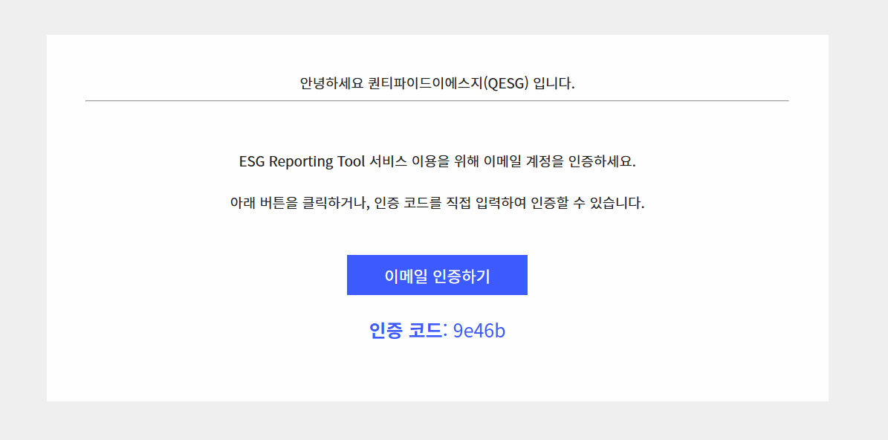

# 회원가입

## 회원가입하기



#### 1. 회원가입 페이지 접속하기

먼저 \[[ESG Reporting Tool 홈페이지](https://report.qesg.co.kr/)]에 접속합니다. 우측 하단에 위치한 \[회원가입] 버튼을 클릭해 주세요. &#x20;



#### 2. 가입 정보 입력하기

가입에 필요한 기본 정보를 입력하는 단계입니다.

* 이메일 주소: 실제 사용 중인 회사 이메일 주소를 입력해 주세요. (이후 인증 단계에서 필요합니다.)
* 이름 및 소속 조직명: 본인의 성함과 소속 조직명에 현재 재직 중인 회사명을 입력합니다.
* 비밀번호: 사용할 비밀번호를 입력합니다.&#x20;
  * 8자\~20자 이내
  * 영어 소문자, 숫자, 특수문자 조합
* 정보 입력을 모두 마쳤다면 하단의 \[가입하기] 버튼을 클릭합니다.

<figure><figcaption></figcaption></figure>

#### 3. 이메일 인증 완료하기

입력하신 이메일 주소로 본인 확인을 위한 인증 코드가 발송됩니다.

* 메일 확인: 수신함에서 '이메일 인증' 메일을 확인해 주세요.&#x20;
  * 메일 발송까지 약 30초 \~ 1분 정도 소요될 수 있습니다.
  * info@qesg.co.kr 주소로 "\[QESG] ESG Reporting Tool 회원가입 인증 코드" 메일이 발송됩니다.&#x20;
* 코드 입력: \[이메일 인증하기] 파란색 버튼을 클릭하거나 메일에 적힌 6자리 인증 코드를 확인하여 서비스 화면의 인증 코드 입력란에 적어주세요.
* 인증하기: 코드를 입력한 후 \[인증하기] 버튼을 누르면 인증이 완료됩니다.

> 💡 메일이 오지 않는다면? 스팸 메일함을 확인하시거나, 약 1분 후에도 도착하지 않을 경우 '재발송' 버튼을 활용해 주세요.

#### 4. 로그인 및 서비스 이용

"인증이 완료되었습니다"라는 안내 문구가 뜨면 모든 가입 절차가 끝난 것입니다.

* \[로그인 하기] 버튼을 클릭하여 방금 가입한 계정 정보를 입력해 주세요.
* 로그인 후 바로 ESG Reporting Tool의 다양한 기능을 이용하실 수 있습니다.

## 비밀번호 찾기





#### 1단계. 비밀번호 재설정 요청하기

* 메뉴 진입: 로그인 화면 하단에 위치한 \[비밀번호 찾기] 버튼을 클릭하여 재설정 화면으로 진입합니다.
* 이메일 입력: 가입 시 사용했던 이메일 주소를 입력한 후, 인증 메일 발송 버튼을 눌러 본인 확인 절차를 시작합니다.


가입하신 이메일이 기억나지 않을 경우, [QESG 문의하기](https://odvvp.channel.io)를 통해 연락해 주시면 도와드리겠습니다.





#### 2단계. 본인 확인 및 인증하기

* 메일함 확인: 입력한 이메일로 발송된 ‘비밀번호 재설정’ 안내 메일을 확인합니다.
* 인증 완료: 메일에 포함된 인증 코드를 복사 후 화면에 입력하거나, \[비밀번호 변경하기] 버튼을 클릭하여 인증 단계를 완료합니다.
* 반드시 아래 비밀번호 재설정을 통해 임시 비밀번호를 변경하시기 바랍니다.&#x20;



## 비밀번호 재설정



#### 비밀번호 재설정 시작

비밀번호를 잊어버린 경우, 아래 단계를 통해 안전하게 계정 액세스를 복구할 수 있습니다.

* 재설정 요청: 로그인 화면 상단의 프로필 아이콘(내 계정 정보)을 클릭해서 내 계정 관리 메뉴로 이동합니다.
* 정보 수정: \[내 정보 수정하기] 버튼을 눌러 내 계정 정보를 변경할 수 있습니다.
* 비밀번호 변경: 비밀번호 변경하기를 눌러 비밀번호를 재설정해 주세요.
* 저장: 새로운 비밀번호를 입력 후 하단의 \[내 정보 저장하기]를 클릭해 저장하세요.

