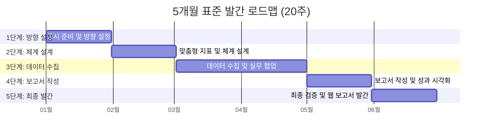

# \[도입] ERT 시작하기

## ESG Reporting Tool (ERT)란 무엇인가요?

ERT(ESG Reporting Tool)는 기업의 복잡한 ESG 데이터를 체계적으로 관리하고, 글로벌 공시 기준에 부합하는 보고서를 신속하게 생성할 수 있도록 지원하는 ESG 공시 전문 솔루션입니다.

## ESG 공시, 왜 해야 하나요?

* 규제 대응: 공시 의무화 및 글로벌 공급망 실사에 선제적으로 대응하기 위해 필요합니다.
* 이해관계자 소통: 기업의 비재무적 성과를 투명하게 공개하여 투자자와 고객의 신뢰를 확보합니다.

꼭 알아야 할 ESG 용어 사전 >>

***

#### 🎯 ERT가 해결하는 실무 고민

초보 담당자가 겪는 3대 어려움을 시스템적으로 해결합니다.

* 가이드 이해 부족: 글로벌 표준(GRI, SASB 등)에 대한 이해가 없어도 단계별 가이드를 통해 기획이 가능합니다.
* 스토리텔링 한계: 정성적인 성과를 글로 풀어내기 어려운 분들을 위해 AI 작성도우미와 표준 문구와 템플릿을 제공합니다.
* 디자인 어려움: 고비용의 외주 디자인 없이도 전문가 수준의 결과물을 얻을 수 있습니다. 입력한 데이터는 실시간으로 차트와 웹 레이아웃으로 시각화되어 자동 완성됩니다.

## ESG 발간  로드맵

**\[1개월차] 1단계: 공시 준비 및 방향 설정**

* 핵심 목표: ESG 공시의 목적을 정의하고 내부 추진 체계를 구축합니다.
*   주요 과업:

    * ESG 및 ERT 기초 학습: 초보자를 위한 ESG 개념 및 최신 공시 트렌드 파악
    * 필수 용어 숙지: GRI, SASB, TCFD 등 글로벌 공시 표준 명칭 및 체계 이해
    * 플랫폼 온보딩: ERT 기본 기능 숙지 및 관리자 계정 권한 설정

**\[2개월차] 2단계: 맞춤형 지표 및 체계 설계**

* 핵심 목표: 우리 기업에 최적화된 공시 기준과 중점 보고 지표를 확정합니다.
*   주요 과업:

    * 산업군 및 표준 선택: 기업 특성에 적합한 가이드라인(GRI 등) 선정
    * 중대성 평가: 이해관계자 분석을 통해 우선순위 보고 지표 결정
    * 프로젝트 팀 구성: 사내 데이터 수집을 위한 부서별 담당자(협업자) 지정

**\[3개월차] 3단계: 데이터 수집 및 실무 협업**

* 핵심 목표: 부서별로 산재된 기초 데이터를 취합하고 무결성을 검증합니다.
*   주요 과업:

    * 기초 데이터 체크리스트: 지표별 필요 데이터(Raw Data) 목록 확인 및 수집
    * 타 부서 협업 요청: ERT 협업 기능을 활용한 효율적인 자료 취합 프로세스 운영
    * 증빙 자료 관리: 공시 신뢰성 확보를 위한 증빙 파일 업로드 및 검토

**\[4개월차] 4단계: 보고서 작성 및 성과 시각화**

* 핵심 목표: 취합된 데이터를 전문적인 문구와 시각적 요소로 변환합니다.
*   주요 과업:

    * 정성적 성과 스토리텔링: 성과별 작성 템플릿을 활용한 전문 문구 기술
    * 수치 데이터 시각화: 입력 데이터의 실시간 그래프 및 인포그래픽 변환
    * AI 가이드 활용: 문장 교정 및 표준 문구 추천 기능을 통한 품질 고도화

**\[5개월차] 5단계: 최종 검증 및 웹 보고서 발간**

* 핵심 목표: 전문가 검수를 완료하고 대외 공시용 웹 보고서를 발행합니다.
* 주요 과업:
  * 전문가 검토 및 피드백: QESG 전문가 검수 요청 및 최종 수정 반영
  * 웹 기반 보고서 발행: 클릭 한 번으로 온라인 ESG 공시 페이지 생성
  * 홈페이지 연결 및 홍보: 발행 보고서를 기업 채널에 연결하여 외부 소통 강화

